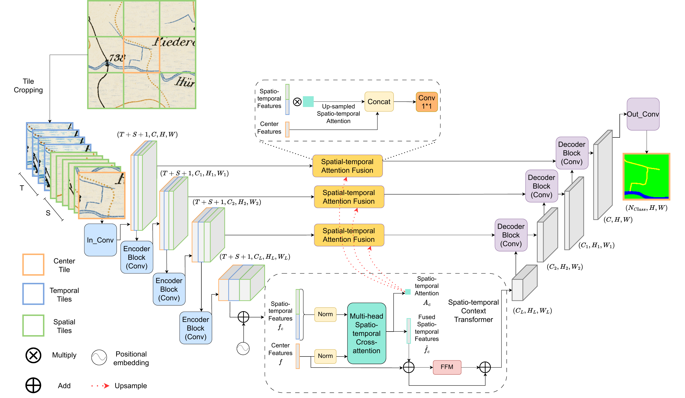

# Spatial-temporal model for historical map segmentation 

PyTorch implementation of "Cross-attention Spatio-temporal Context Transformer for Semantic Segmentation of Historical Maps". This paper was accepted at [ACM SIGSPATIAL 2023](https://sigspatial2023.sigspatial.org/) for oral presentation.

## Abstract
Historical maps provide useful spatio-temporal information on the Earth’s surface before modern earth observation techniques came into being. To extract information from maps, neural networks, which gain wide popularity in recent years, have replaced hand-crafted map processing methods and tedious manual labor. However, aleatoric uncertainty, known as data-dependent uncertainty, inherent in the drawing/scanning/fading defects of the original map sheets and inadequate contexts when cropping maps into small tiles considering the memory limits of the training process, challenges the model to make correct predictions. As aleatoric uncertainty cannot be reduced even with more training data collected,
we argue that complementary spatio-temporal contexts can be helpful. To achieve this, we propose a U-Net-based network that fuses spatio-temporal features with cross-attention transformers(U-SpaTem), aggregating information at a larger spatial range as well as through a temporal sequence of images. Our model achieves a better performance than other state-or-art models that use either temporal or spatial contexts. Compared with pure vision transformers, our model is more lightweight and effective. To the best of our knowledge, leveraging both spatial and temporal contexts have been rarely explored before in the segmentation task. Even though our application is on segmenting historical maps, we believe that the method can be transferred into other fields with similar problems like temporal sequences of satellite images.



If you find this code useful in your research, please cite our [paper](https://arxiv.org/abs/2310.12616):

```
@article{wu2023cross,
  title={Cross-attention Spatio-temporal Context Transformer for Semantic Segmentation of Historical Maps},
  author={Wu, Sidi and Chen, Yizi and Schindler, Konrad and Hurni, Lorenz},
  journal={arXiv preprint arXiv:2310.12616},
  year={2023}
}
```

### Project Structure

Structure of this repository:

```
|
├── dataset                     <- Dataset for training
├── img                         <- Images
├── loss                        <- Loss function
├── model                       <- Jupyter notebooks and Python scripts.
│   ├── spa                     <- Spatial model
│   ├── spatem                  <- Spatial+temporal model
|   ├── tem                     <- Temporal model
│   ├── unet                    <- Unet model
│   ├── unet3d                  <- 3d unet model
│   ├── utae                    <- L-TAE model
├── viz                          <- Visualization utiliy function
├── data.py                      <- Dataloader
├── environment.yml              <- Conda environment .yml file
├── log.py                       <- Log management file
├── train_*.py                   <- Training codes for different models (* segformer, spatial_temporal, ...)
└── README.md
```

## Installation :star2:

### 1. Create and activate conda environment

```
conda env create -f environment.yml
conda activate sigspatial
```

### 2. Download spatial-temporal historical maps dataset (training dataset)

The training dataset could be download from:

* [spatial-temporal-historical-map](https://www.polybox.ethz.ch/index.php/s/3ClqXVxRKFNFp8d)

And it should be placed within the 'dataset/' directory.

🚨: At present, we have made the training patch dataset available for release. 
Regarding the testing set, we plan to release it as soon as we obtain the necessary copyrights from [swisstopo](https://www.swisstopo.admin.ch/).

## How to use :rocket:

### 1. Train models

* [Segformer (paper)](https://proceedings.neurips.cc/paper/2021/file/64f1f27bf1b4ec22924fd0acb550c235-Paper.pdf)
```
python train_segformer.py --cuda --gpu 0 --lr 5e-4 --batch-size 10
```

* [U-SpaTem model]()
```
# U-spa
python train_spatial.py --cuda --gpu 0 --lr 5e-4 --batch-size 10

# U-temp
python train_temporal.py --cuda --gpu 0 --lr 5e-4 --batch-size 10

# U-spa-temp (with different head options)
python train_spatial_temporal.py --cuda --gpu 0 --lr 5e-4 --batch-size 10  --n_head 4
python train_spatial_temporal.py --cuda --gpu 0 --lr 5e-4 --batch-size 10  --n_head 8
python train_spatial_temporal.py --cuda --gpu 0 --lr 5e-4 --batch-size 10  --n_head 16
```

* [U-Net (paper)](https://arxiv.org/pdf/1505.04597.pdf%EF%BC%89)
```
python train_unet.py --cuda --gpu 0 --lr 5e-4 --batch-size 10
```

* [3d-unet (paper)](https://arxiv.org/pdf/1606.06650.pdf%E4%BB%A3%E7%A0%81%E5%9C%B0%E5%9D%80%EF%BC%9Ahttps://github.com/wolny/pytorch-3dunet)
```
python train_unet3d.py --cuda --gpu 0 --lr 5e-4 --batch-size 10
```

* [U-TAE (paper)](https://openaccess.thecvf.com/content/ICCV2021/papers/Garnot_Panoptic_Segmentation_of_Satellite_Image_Time_Series_With_Convolutional_Temporal_ICCV_2021_paper.pdf)
```
python train_utae.py --cuda --gpu 0 --lr 5e-4 --batch-size 10
```

Results and weights are saved at `training_info/`.

### 2. Acknowledgement
We appreciate helps from:  
* Public code [U-TAE](https://github.com/VSainteuf/utae-paps.git)
